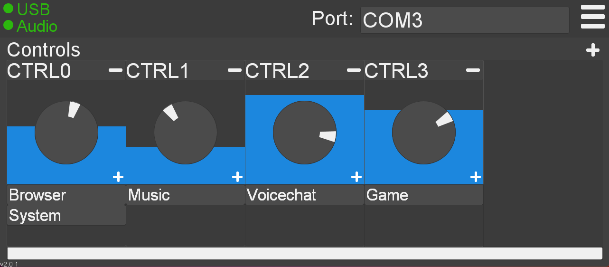

# Ryolith   

- **Ryolith is an Audiocontroller written in Java** that controls the volume of processes individually.

- **Create groups**, add different **programs to each group** and add the groups to your new **controls**.

- **The Arduino** or any other programmable USB-Device can connect to the program to **control** it.





> *Tip: **Connect an Arduino** to it, by clicking next to "Port:", so you don't have to tab out of your **Game/Application** to change the volume.*

## Install (Windows/Linux)

Just download the latest `.jar` and execute.<br>
It should automatically download/update any files needed.

## Usage of Arduino/RaspberryPi

### Using USB-Control on Linux

1. You might need to **add your User** to some of those **4 groups**<br>
   Don't worry if some of the commands fail. All of these groups may not exist on every Linux distro.
    ```shell
    sudo usermod -a -G uucp,dialout,tty $USER
    ```

2. **Log out** and you should have **access** to the serial port **after logging back in**

   *If Problems still occur check
   the [**Troubleshooting-Wiki**](https://github.com/Fazecast/jSerialComm/wiki/Troubleshooting) of
   the [USB-Library](https://github.com/Fazecast/jSerialComm)*

### Programming

You can program your Microcontroller to `Serial.print()` control-commands to the Java-Programm.

- Each command starts with `ac[` and ends with `]`.
- The message between should consist of the `Control-Name` a seperator `|` and a volume-`value` between **0-1000**

For Example: `ac[slider1|500]` sets the control `slider1` in the Java-program to `50%`.
<br>
You can also look into my [Arduino](Arduino/ryolith.ino)-example I use every day.

## Config

If you want to edit the configs manually: At your own risk! You can find the files at your **Home-Directory**
in `%HOME%/.ryolith`

## Build-Note
1. Make sure maven works correctly

2. Setup pip environment:
```bash
pipenv install
```

3. `maven install` to build jar and windows-executable

## TODO

* add Min- & Max-Values for Processes
* Serial-Protocol for directly controlling a processes' Volume
* Logger